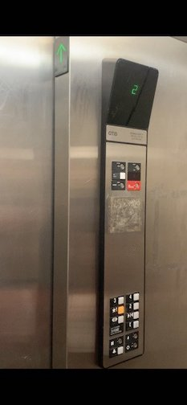
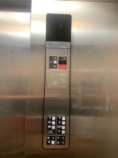
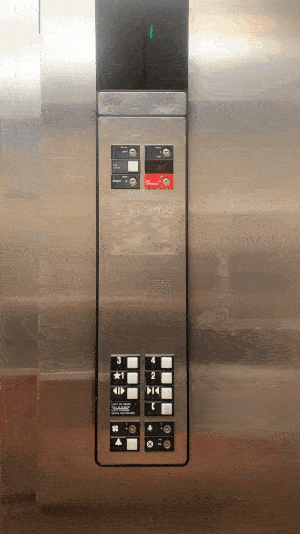
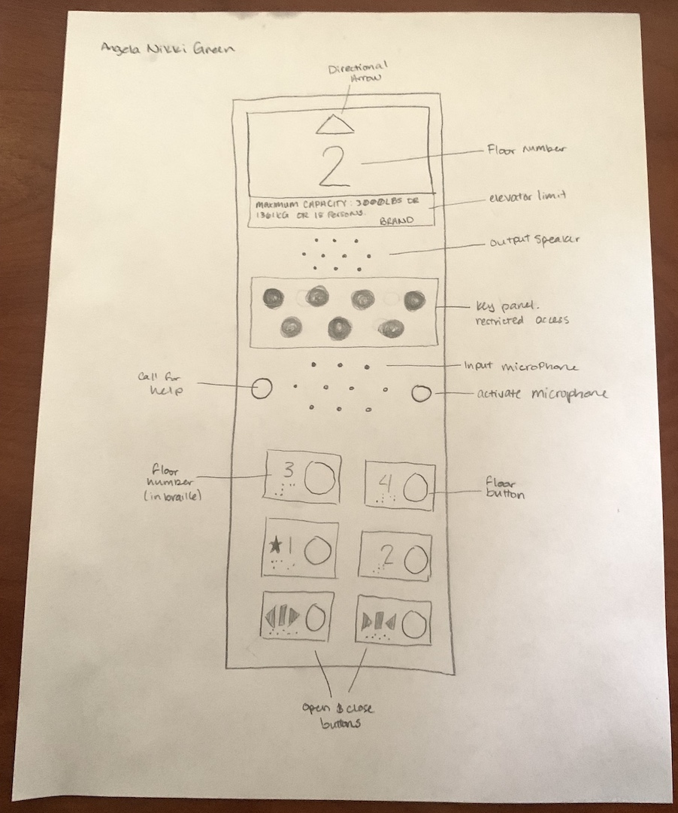
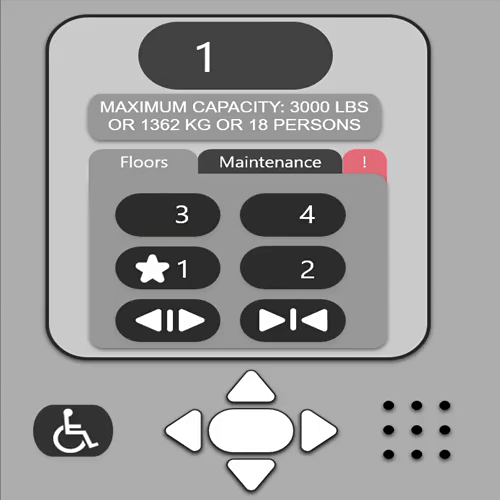

# TheElevatorInterface
Human Computer Interaction - Homework 1: The Elevator Interface

Figure 1: The internal interface and locating where the directional arrow is located (in the same space as the doors).

Figure 2: The internal interface head-on.

Figure 3: The internal elevator in use. 

**Part C**

**Basic Issues with the Elevator**
- The internal interface has no sound when pressing buttons, or arriving at the destination.
- The directional arrows in the internal interface (that show  which direction the elevator is going) is in the same space as the doors. They're only visible from one side of the elevator.
- The buttons and labels have been heavily used and it's prevalent in the chipped paint on the labels.

**Why the Basic Issues are Bad**
- The internal interface's lack of sound isn't crucial to having a good design, although it would help the user's experience in knowing if the doors are about to open or letting the user know that they arrived at their destination.
- Hiding the directional arrows is definitely a poor design choice. Instead of implementing a 2-in-1 screen with both the floor number and the directional arrow on one screen, they separated them making the user have to look at two different places. The user is unable to see the arrow unless they are in a specific area in the elevator. This should be something that's visible for any user from any area when riding in the elevator.
- If the labels get worn down, it can be hard to read which destination correlates to which button.

**Part B**

**Common and Rare Elevator Usage**
- Common uses for this elevator include going to the floor of my apartment or going to the ground floor of the building. 
- Rare uses include going to other floors of the apartment to visit neighbors. 
- This interface makes traveling across floors easier than using the stairs.  

**Common Sequence of Actions in an Elevator**
- Call the elevator using external interface.
- Wait until the elevator arrives and the doors open.
- Step inside the elevator.
- Turn around and view the internal interface.
- Press the desired floor.
- Wait until the doors close and the elevator travels to the desired floor. 
- When the doors open, exit the elevator.

**Feedback**
- The elevator provides visual feedback in the backlight of the buttons. When a button is pressed for a desired floor, the backlight will light up the floor label on the button.
- The elevator also provides a visual arrow in the same space as the doors as previously mentioned.

**Common mistakes** 
- A user may press the wrong floor button and have to wait until after the elevator stops at the incorrect floor to get to their desired destination. 
- A user might also confuse the alarm button and the "Call for Help" button in an emergency. 

Figure 4: Redesigned interface sketch with improvements.

**Improvements** 
- Directional arrow at the top to indicate which direction the elevator is going. 
- Emergency & Maintenance panel in the middle as they aren't commonly used and to avoid children's reach.
- Floor input buttons are at the bottom of the panel for easy access for handicap accessibility. 
- Labels are off to the side of the button so that the button itself can fully light up when activated. 

**Part A** 

- Ideally, the screen size for the interface would be (1390, 1638)px - This demo size doubled. 
- This demo provides the UI screen, while also including the metal panel that will hold the handicap accessible buttons. 
[Demo](https://xd.adobe.com/view/e273f821-5a53-4d83-7a10-43ccff9e5c4c-9442/?fullscreen)

**Demo Instructions**
- Able to go up (4th floor button)
- Able to go down (1st floor button) 
- Able to use handicap arrows (press arrows)
- Able to go into maintenance (click maintenance tab)
- Able to enter pin and access maintenance screen (click enter and turn something on and off)
- Able to go into the emergency tab (click '!' tab)
- Able to enable/disable alarm and call for help (activate both buttons and deactivate both buttons)
- Able to click back to the floors tab (click floors tab)
